# Delicious Bytes - Relatório Final
### Renan Pedreira de Oliveira - 2401854

## 1. Contextualização do Projeto

O **Delicious Bytes** é um website dedicado à partilha de receitas culinárias. Utilizadores podem criar, visualizar e gerir receitas, tornando-as visíveis para outras pessoas na plataforma. O sistema permite que qualquer pessoa consulte receitas disponíveis, enquanto funcionalidades avançadas, como a criação e edição, requerem autenticação.

## 2. Funcionalidades

O projeto **Delicious Bytes** inclui diversas funcionalidades para facilitar a experiência do utilizador:

- **CRUD Completo de Receitas**
  - Criar novas receitas.
  - Editar receitas criadas.
  - Remover receitas criadas.
  - Listar todas as receitas disponíveis.

- **Pesquisa e Filtros**
  - Permite buscar receitas pelo nome.
  - Filtro por categoria.

- **Autenticação e Permissões**
  - Registo e login de utilizadores.
  - Apenas utilizadores autenticados podem criar receitas, editar e remover receitas.
  - Utilizadores podem visualizar qualquer receita sem login.

## 3. Arquitetura

A plataforma **Delicious Bytes** segue uma arquitetura distribuída, composta por:

- **Frontend:** Implementado em **Vue.js**, gerindo a interface e interações do utilizador.
- **Backend:** Desenvolvido em **Express.js**, lidando com a lógica de negócio, armazenamento e processamento de dados.
- **Base de Dados:** **MongoDB**, utilizado para armazenar as informações das receitas e dos utilizadores.
- **Protocolo de Comunicação:** O sistema opera via **HTTP REST API**, utilizando requisições GET, POST, PUT e DELETE.

## 4. Prototipagem

Para planejar a interface do **Delicious Bytes**, foram criados **wireframes** e **mockups**, servindo de base para o desenvolvimento do frontend. Esses protótipos auxiliaram na definição da disposição dos componentes, fluxos de usuário e usabilidade da aplicação.

Os principais elementos prototipados incluem:
- **Tela Inicial**: Exibição de receitas cadastradas e barra de pesquisa.
- **Tela de Cadastro/Login**: Campos para credenciais de acesso.
- **Tela de Criação/Edição de Receita**: Formulários com upload de imagem e campos de texto.
- **Tela de Visualização de Receita**: Apresentação de detalhes da receita, autor e imagem.

## 5. Autenticação

O sistema de autenticação utiliza **JSON Web Tokens (JWT)**:

- O utilizador realiza login e recebe um **token JWT**.
- O token é armazenado no localStorage do navegador.
- As chamadas para endpoints protegidos incluem o token no cabeçalho de autorização.
- Somente o utilizador autenticado pode modificar ou remover as suas receitas.

## 6. Frontend

O frontend foi implementado em **Vue.js**, utilizando:

- **Componentes**: Header, Footer e componentes individuais para gestão de receitas.
- **Vue Router** para a navegação entre páginas.
- **Gestão de Estado** via **localStorage** para autenticação.

Principais Componentes:

- `HeaderComponent.vue`: Barra superior de navegação.
- `FooterComponent.vue`: Rodapé da aplicação.
- `Home.vue`: Lista todas as receitas e filtros.
- `RecipeForm.vue`: Formulário de criação e edição.
- `RecipeDetails.vue`: Exibe os detalhes de uma receita.

## 7. Backend

O backend é responsável pelo processamento dos dados e implementa os seguintes endpoints:

- `POST /users/register`: Registar novo utilizador.
- `POST /users/login`: Autenticação.
- `GET /recipes`: Listar receitas com filtros.
- `POST /recipes`: Criar receita (Requer autenticação).
- `GET /recipes/:id`: Obter detalhes de uma receita.
- `PUT /recipes/:id`: Atualizar uma receita (Requer autenticação).
- `DELETE /recipes/:id`: Remover receita (Requer autenticação).

## 8. Teste de Uso

Para validar o funcionamento da plataforma, foram realizados os seguintes testes:

### 8.1 Visualização de receitas sem login
- Ao aceder a página inicial, verifica-se que é possível visualizar todas as receitas sem necessidade de login.
- Detalhes das receitas também são acessíveis sem autenticação.

### 8.2 Registo e Login
- Criou-se um novo utilizador com os seguintes dados:
  - **Email:** `DB_User@email.com`
  - **Senha:** `teste123`
- Efetuamos login com sucesso e verificamos a geração do token JWT.

### 8.3 Criação de Receita
Criou-se uma nova receita chamada **Brigadeiro**, com os seguintes detalhes:

- **Categoria:** Sobremesa
- **Ingredientes:**
  - 1 lata de leite condensado
  - 2 colheres de sopa de cacau em pó
  - 1 colher de sopa de manteiga
  - Chocolate granulado para cobrir
- **Modo de Preparo:**
  1. Em uma panela, misture o leite condensado, o cacau em pó e a manteiga.
  2. Cozinhe em fogo médio, mexendo sempre até desgrudar do fundo da panela.
  3. Deixe esfriar e forme bolinhas.
  4. Passe as bolinhas no chocolate granulado.
  5. Sirva e aproveite!

### 8.4 Gestão de Receita
A nova receita já aparece na listagem e por ser de autoria do utilizador em sessão, é possível editar ou deletar a mesma.

### 8.5 Edição de Receita
- Alterou-se a receita de Brigadeiro para uma nova imagem.
- Após salvar a alteração, verifica-se que esta foi aplicada.

### 8.5 Exclusão de Receita
- Testou-se a exclusão da receita **Brigadeiro**.
- A receita foi removida com sucesso e não aparece mais na listagem.

## 9. Execução do Projeto
Para rodar o projeto localmente, siga os passos abaixo:

### Backend
```bash
cd Backend
npm install
npm start
```

### Frontend
```bash
cd Frontend
npm install
npm run dev
```


## 10. Anexos

### 1. Wireframes
Os wireframes foram utilizados para definir a estrutura inicial da aplicação, organizando os principais componentes e fluxos antes do desenvolvimento.

- **Listagem de receitas**
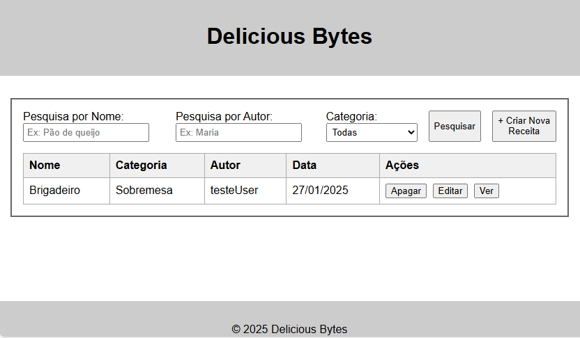

- **Ecrã de autenticação**
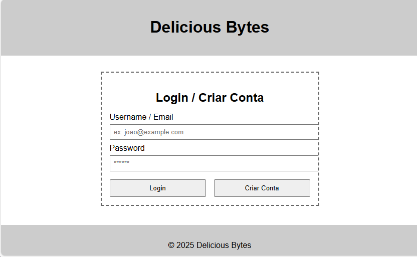

- **Formulário da receita**
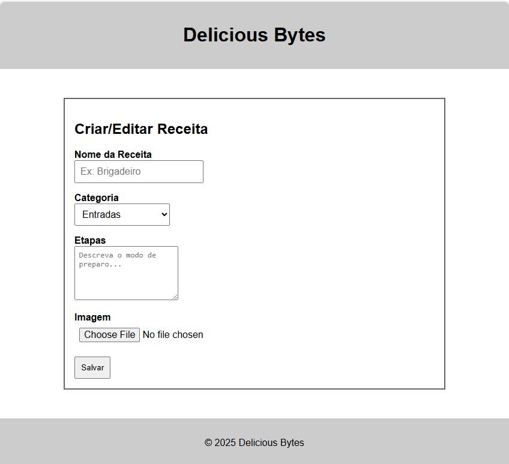

- **Detalhes da receita**
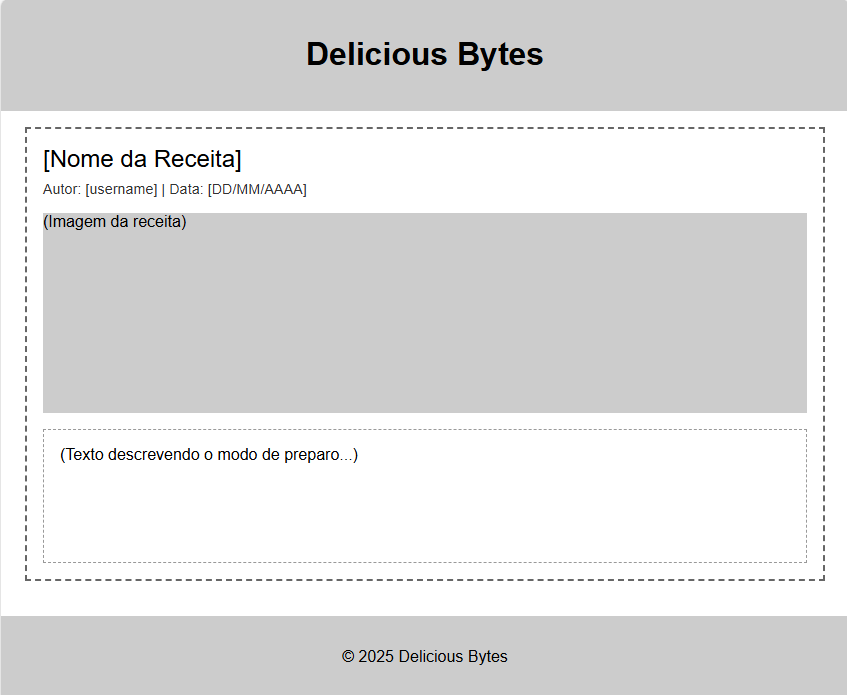

---

### 2. Mockups
Os mockups ilustram como a interface do sistema foi planejada visualmente antes da implementação.

- **Listagem de receitas**
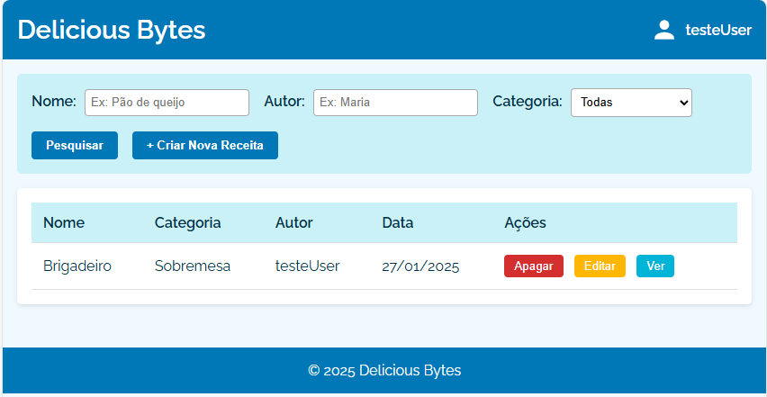

- **Ecrã de autenticação**
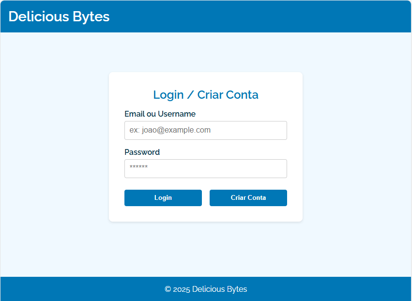

- **Formulário da receita**
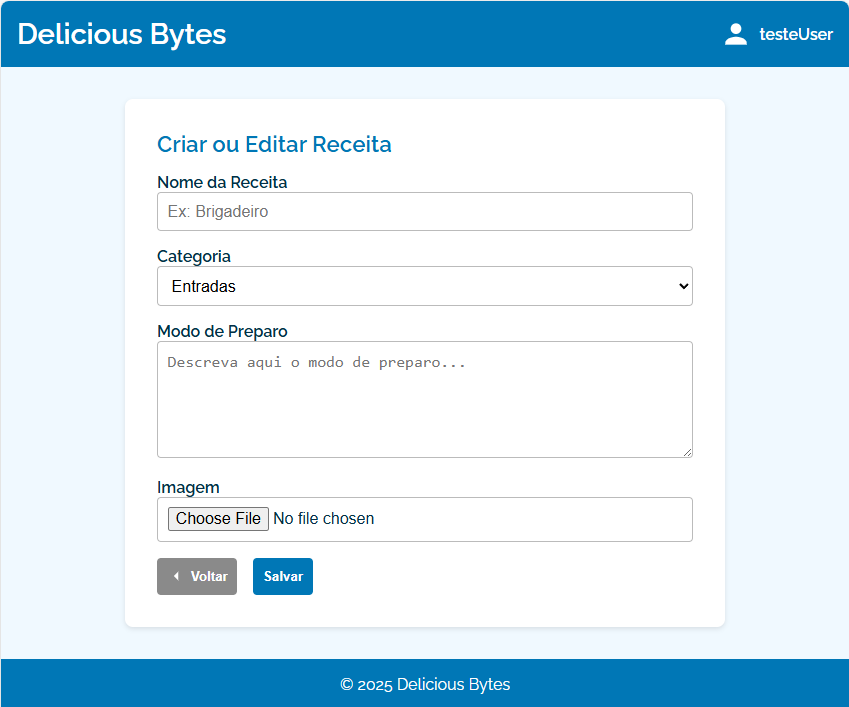

- **Detalhes da receita**
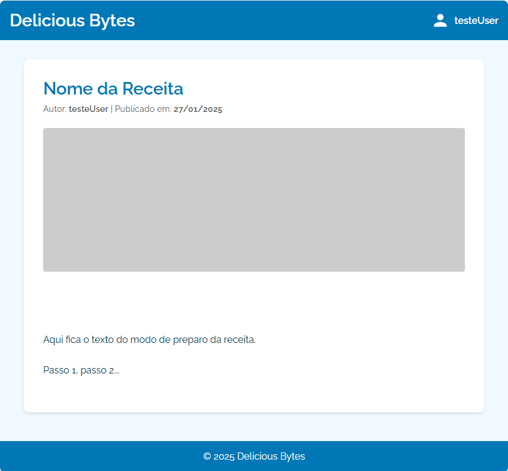

---

### 3. Testes do Sistema
Os testes demonstram o funcionamento correto do sistema, desde a navegação até a criação e edição de receitas.

- **Listagem de receitas - sem autenticação**
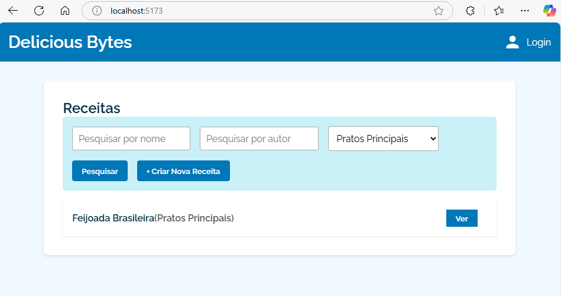

- **Detalhes de receita - sem autenticação**
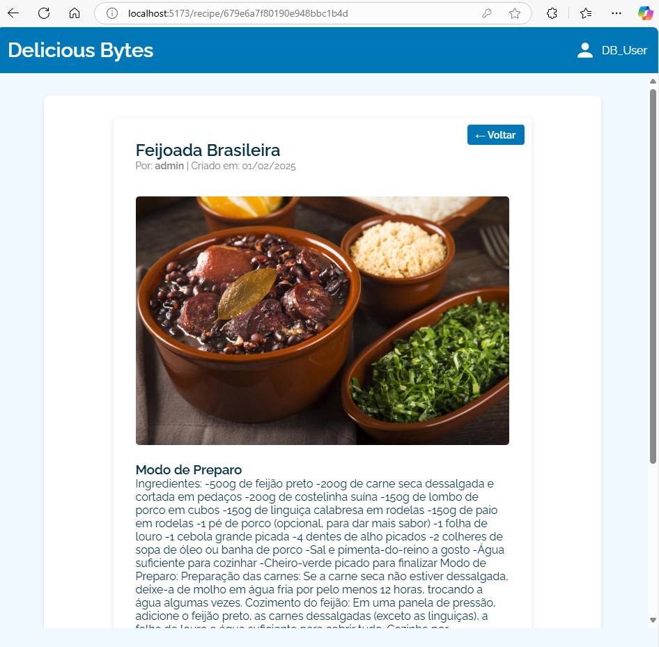

- **Registo de novo utilizador**
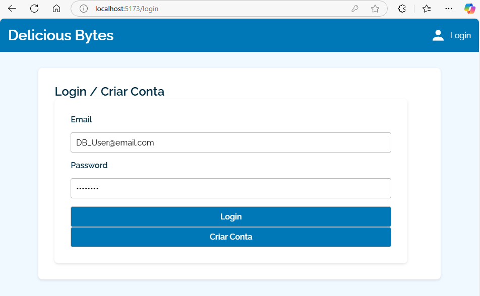

- **Criação de nova receita**
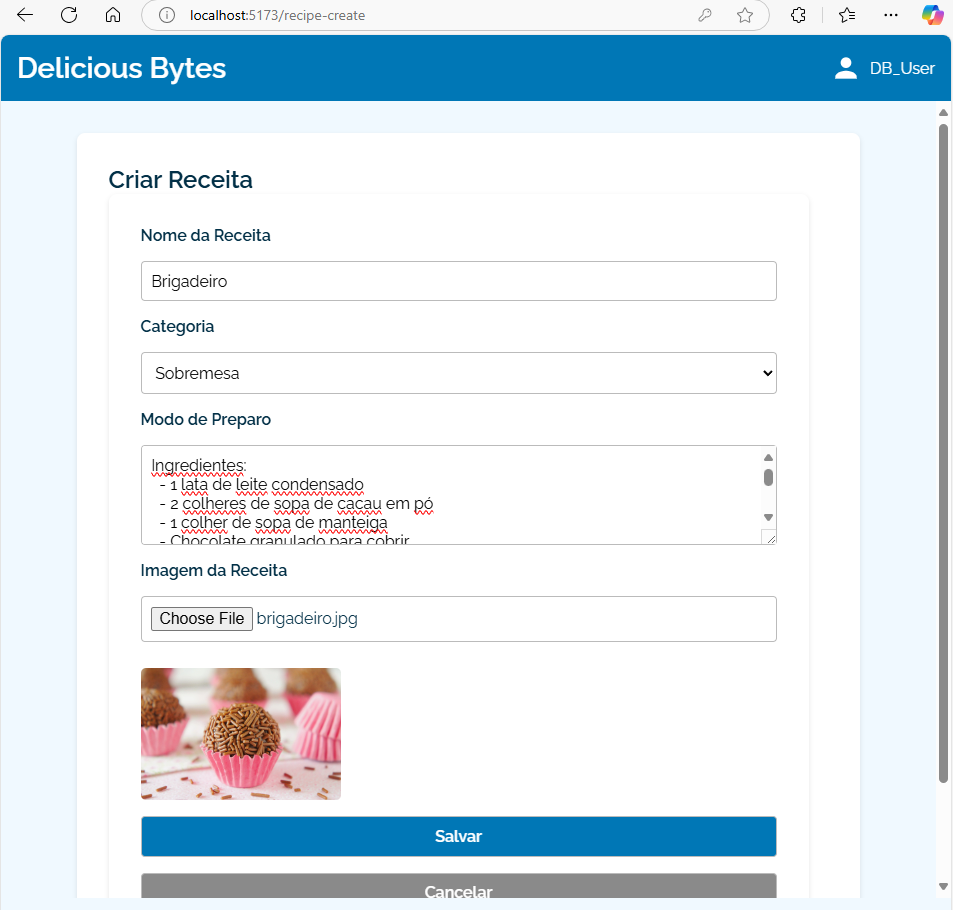

- **Listagem com a nova recita e opções**
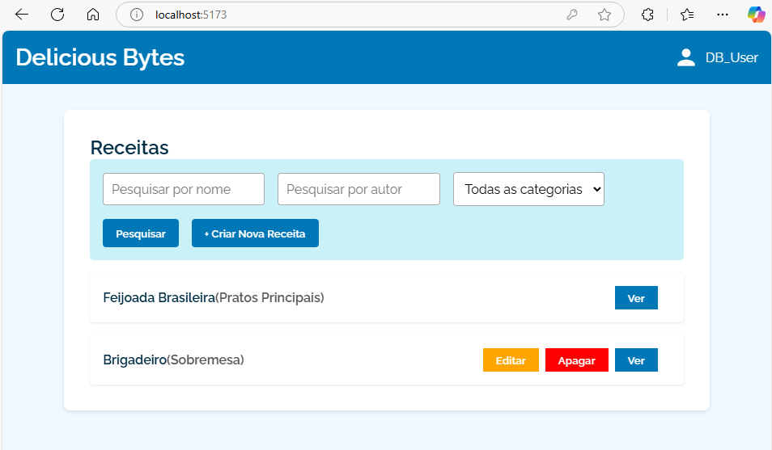

- **Edição da receita**
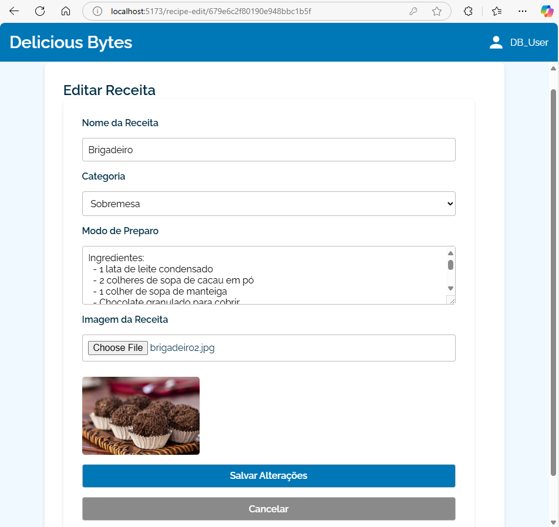

- **Detalhes da nova reiceita - pós alteração**
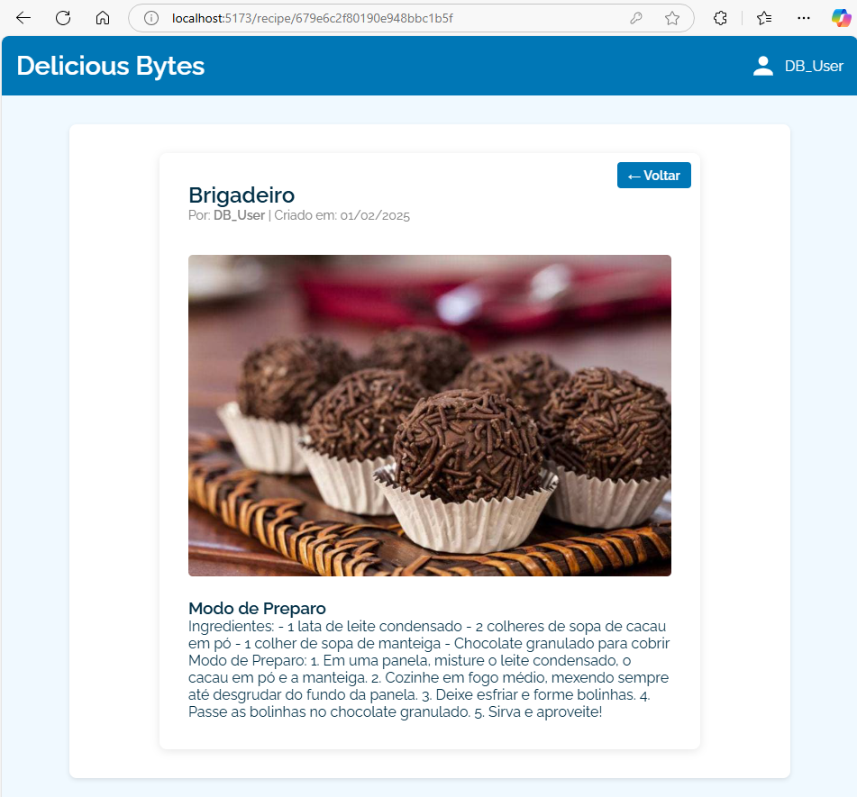

- **Tentativa de remover uma receita**
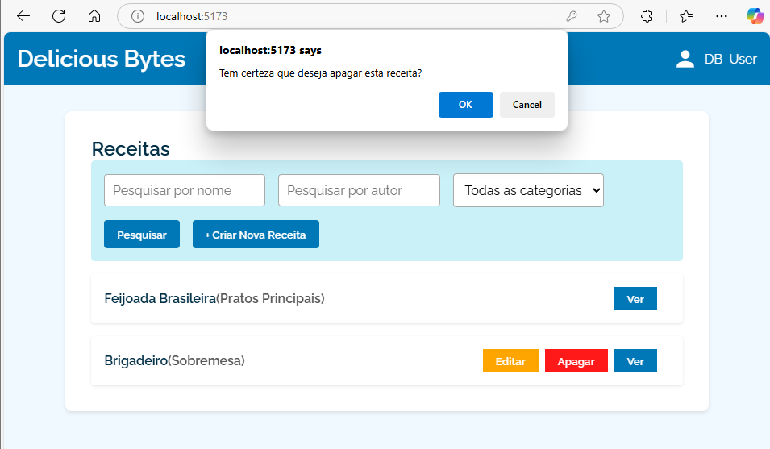

- **Receita deletada já não aparece na listagem**
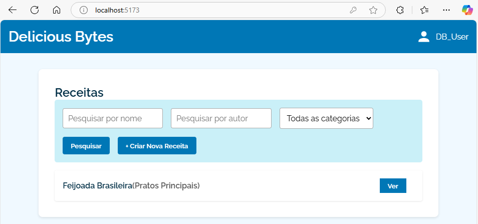